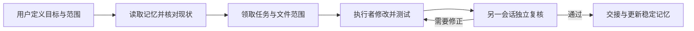

# AI-teamworks · AI 协作开发指南

让 Codex、Claude Code、OpenCode / DeepSeek、ZCode / GLM 围绕同一项目分工、交接和复核，并在一个窗口查看协作进度。

**版本：v0.2.0-preview · 文档核对日期：2026-09-09 · 状态：多模型与协作窗口预览**

这是一套从个人 AI 工具中枢实践整理的搭建指导，附带应用仓库链接、可复制提示词、协作规则和本地 coord 面板。目标仓库：`brooksmaryln584-lang/AI-teamworks`。提供记忆协作 Skill、receipt 校验器和新报告创建器；本机 provider 配置及私人数据库不分发。提示词约定不能替代工具权限控制。

## 打开协作窗口

在仓库根目录，用 Python 3.10+ 启动；无需第三方依赖：

```powershell
python -m dashboard.server --open
```

窗口显示任务看板、会话心跳、模型与范围声明、租约提示和交接路径。默认连接本机 coord，每 5 秒刷新；coord 离线会明确提示。详见 [面板指南](docs/dashboard.md)。

尚未启动 coord 时，可先看清晰标注的合成演示：`python -m dashboard.server --demo --port 8788 --open`。

## 从这里开始

1. 阅读 [搭建指南](docs/setup.md)，在一个练习项目中准备两个会话。
2. 使用 [AGENTS.md](AGENTS.md) 作为共享规则，配合 [CLAUDE.md](CLAUDE.md)。[AGENT.md](AGENT.md) 是名称说明入口。
3. 填写 [任务与交接模板](templates/task-and-handoff.md)，明确允许修改的文件和验收方法。
4. 分别发送 [提示词示例](prompts/examples.md) 中的执行与复核提示词。
5. 根据 [协作流程](docs/workflow.md) 记录证据，再做下一轮修改。
6. 按 [多模型接入指南](docs/multi-model.md) 加入 OpenCode / DeepSeek 或 ZCode / GLM，再使用 [跨模型交接协议](docs/handoff-protocol.md) 接力。

## 为什么这样协作

| 常见问题 | 本方案的做法 |
| --- | --- |
| 新会话遗漏历史决定 | 先读项目记忆和交接，再核对当前文件 |
| 两个 AI 同时改同一文件 | 使用互斥范围；冲突时停止并重新分配 |
| “完成了”但没有验证 | 提交实际命令、退出码、变更清单和限制 |
| 同名会话互相混淆 | 每个会话使用唯一身份，不以模型名称代替身份 |
| 配置在多个项目漂移 | 中枢维护共享规则，项目记录接入位置和版本 |
| 长任务不断自动继续 | 约定最大轮次、预算、检查点和停止条件 |



Codex 和 Claude Code 都可以承担执行或复核角色；角色按任务分配。不同会话也可能犯相同错误，因此独立复核仍需检查实际产物和测试。

## 应用与扩展

选择已完成能力验收的编码客户端配合 Git；多会话通过 coord 协调。OpenCode / DeepSeek 与 ZCode / GLM 的接入步骤已补充。CC Switch、Ollama、uv、PowerShell 和 GitHub CLI 按需使用，详见 [工具仓库清单](docs/tools.md)。

公开 GitHub 仓库不等于整个产品采用开源许可证；各应用的授权范围、账号与服务费用以其上游说明为准。本指南不提供第三方账号或模型额度。

## 阅读导航

- [搭建与首次验收](docs/setup.md)
- [多模型接入与客户端差异](docs/multi-model.md)
- [协作展示窗口](docs/dashboard.md)
- [跨模型交接协议](docs/handoff-protocol.md)
- [工作流与状态定义](docs/workflow.md)
- [应用仓库与来源](docs/tools.md)
- [提示词示例](prompts/examples.md)
- [任务、会话记录与交接模板](templates/task-and-handoff.md)
- [注意事项与排错](docs/cautions.md)
- [中枢工具包](docs/hub-toolkit.md)
- [权限与配置所有权](docs/permissions.md)
- [Ollama 接入](docs/ollama.md)
- [发布清单](docs/release-checklist.md)
- [贡献约定](CONTRIBUTING.md)

## 发布状态与许可

目标仓库为 `brooksmaryln584-lang/AI-teamworks`，账号显示名称为 lzx。本项目文档、提示词和自有脚本采用 [MIT 许可证](LICENSE)，版权署名为 lzx。第三方工具保留其自身许可证。面板已通过本地接口测试及真实 coord 隔离数据库生命周期测试；新客户端文档已核对官方来源，本轮未使用真实账号运行 DeepSeek/GLM 推理。完整跨客户端能力验收与独立复核仍需补充，见 [发布检查](docs/release-checklist.md)。
